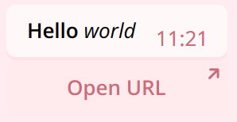

# Neko Push

This is a simple tool that can push any text message to your Telegram.

## Usage (Official instance)

1. Play with [the bot](https://t.me/neko_push_bot) to get chat ID. 
2. Use the api to push messages!

**You must use the bot (/start) at least once to get your messages pushed.**

## API

The official API endpoint is at [https://push.meowbot.page/push](https://push.meowbot.page/push). You can use GET or POST method to interact with the API.

### Push API v1

This is the simpler way to use the push api.

#### GET method

| Name | Required | Type | Description |
| ---- | -------- | ---- | ----------- |
|  id  |   True   | Number | ChatID you get from the bot |
| text |   True   | String | Text message you wish to push |
| html |   False  | Boolean | Enable [Telegram HTML formatting](https://core.telegram.org/bots/api#html-style) |

The response will be `ok` if your message is pushed without problem.
The response will be `Bad request` if some required params are missing.
Otherwise the response will be the error message.

For example:

Make a get request to `https://push.meowbot.page/push?id=12345&text=Hello` will result in message `Hello` being pushed to chatid `12345` (if the chatid exists)

#### PUSH method

Params in PUSH method are in JSON form.
All PUSH requests must set `Content-Type` to `application/json` in their headers.

| Name | Required | Type | Description |
| ---- | -------- | ---- | ----------- |
|  id  |   True   | Number | ChatID you get from the bot |
| text |   True | String | Text message you wish to push, or caption of the file. |
| html |   False  | Boolean | Enable [Telegram HTML formatting](https://core.telegram.org/bots/api#html-style). |
| buttons | False | InlineKeyboardButton[][] | See [Telegram docs](https://core.telegram.org/bots/api#inlinekeyboardmarkup). |
| version | False | Number | This field must be `1` when using push API v1. |

*Currently `callback_data` buttons don't have any effect.*

For example:

```JSON
{
    "id": 12345,
    "text": "<b>Hello</b> <i>world</i>",
    "html": true,
    "buttons": [[{
        "text": "Open URL",
        "url": "https://meowbot.page/"
    }]]
}
```

Message **Hello** *world* will be pushed to chatid `12345`, with one button `Open URL` below it. 



### Push API v2

The push API v2 provides rich content types support. 
It allows you to directly use some of telegram's API methods. You can read telegram's documents [here](https://core.telegram.org/bots/api#available-methods).
Currently only methods starting with `send` are allowed.

Push API v2 only support `POST` method.
All PUSH requests must set `Content-Type` to `application/json` in their headers.

| Name | Required | Type | Description |
| ---- | -------- | ---- | ----------- |
| version | True  | Number | This field must be `2`. |
| method  | True  | String | The telegram method you wish to use. Must start with `send`. |
| params  | True  | Object | The request params. |


## Deploying your own

You can also deploy your own bot and push service.

### Creating a bot

Go to [BotFather](https://t.me/BotFather) and create a bot. Remember your bot **token**.

### Deploying cloudflare worker

You need a cloudflare account to use worker.

Clone or download source code. Run `yarn` once to install dependencies.

Then you need to create to secrets: `BOT_TOKEN` and `ADMIN_SECRET`.
`BOT_TOKEN` is what you get when creating the bot. `ADMIN_SECRET` is a password set by you and we will need it later.

Run `npx wrangler secret put ADMIN_SECRET` and set your `ADMIN_SECRET`.
Run `npx wrangler secret put BOT_TOKEN` and set your `BOT_TOKEN`.
At last run `yarn deploy` to deploy the worker.

### Setting up webhook

You will need to setup a webhook for your bot to react with your command.

**Before going on, it is strongly recommended to set a custom domain for your worker. Using the default domain may encounter SSL error when telegram try to push updates to your worker. You can do it on cloudflare dashboard.**

Now open https://your.worker.domain.example/setup?ADMIN_SECRET . Replace your.worker.domain.example with your domain and `ADMIN_SECRET` with the one you previously set.
If everything goes fine, you will see something like `SetCommands ok SetWebhook at https://your.worker.domain.example/telegram Webhook was set`.

### Deleting webhook

In case you don't want to use the webhook anymore, just open https://your.worker.domain.example/unsetup?ADMIN_SECRET.

### Troubleshooting

If your bot doesn't react to your command, go to https://api.telegram.org/bot{token}/getWebhookInfo. Replace the {token} with bot token. *Don't remove `bot` before the token.*
You can see whether there are errors pushing updates to your worker.